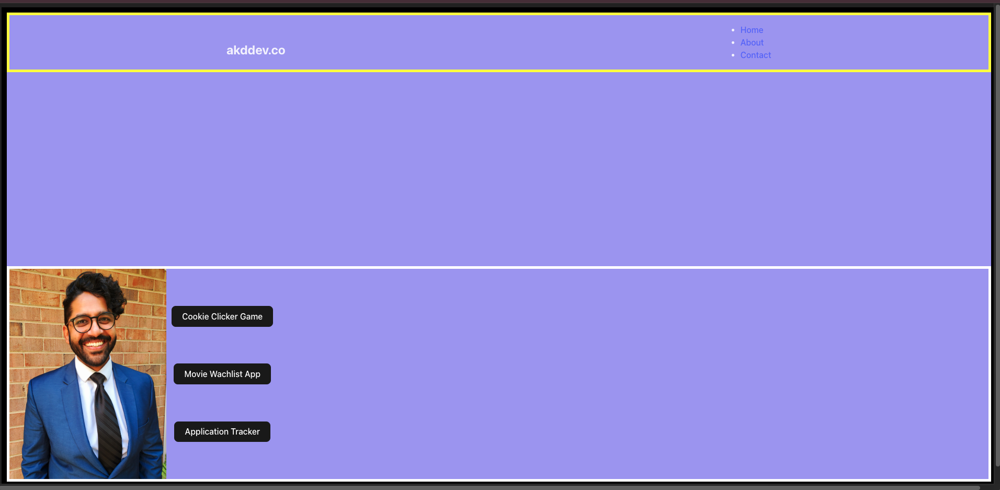

# Abdullah Durrani's Portfolio

This portfolio showcases my projects and skills in web development, particularly in front-end technologies and interactive web applications. The estimated date of completion is 4/25/2025, reflecting my peak commitments as a tax preparer during this period.

**Explore the projects to see demonstrations of my coding abilities and design insights.**

## Notes

### Update: March 5, 2025

**Challenge Encountered:**
I encountered difficulties in adjusting the layout when applying flex properties via the `app.css` to the `body`. The desired layout adjustments weren't achieved, which suggested that both components might need a common parent container for better control.

Despite the `body` tag serving as a container, directly styling it in `app.css` did not produce the expected results, particularly in terms of flex spacing between the `home` and `nav` components.

**Solution Implemented:**
To address this, I introduced a `main` div as a parent for these components. Initial tests suggest that this setup allows for more precise control over component widths and layout adjustments.

**Result:**
After hours of tweaking and adding a 'main' component with specific CSS settings, I finally achieved the desired layout:

```jsx
return (
  <>
    <main className='main-component'>
      <div id='navbar-component'> 
        <Nav />
      </div>
      <div id='home-component'>
        {page === "Home" && <Home setPage={setPage} />}
      </div>
    </main>
  </>
);
```

<details>
<summary>Subsequent CSS that resolved the issue and yielded desired results</summary>

```css
.main-component {
    border: 10px solid black;
    width: 98vw;
    height: 96vh;
    display: flex;
    flex-direction: column;
    justify-content: space-between;
}
```
</details>
<br>

## Current Portfolio Snapshot
<details> 
<summary>View Current Portfolio Build</summary> 

 
</details> 

## Updates: June 14th, 2025

- **Single-Page Layout:**  
  The landing page now displays the site title, navigation bar, centered profile image, and project buttons—all visible within the viewport without scrolling.
- **Component Organization:**  
  The project uses a clear folder structure with separate directories for components (`Home`, `Nav`, `Footer`), images, and styles.
- **Responsive Flexbox:**  
  The main layout is managed using a flex column (`.main-component`), with the center content (`#home-component`) flexed to fill available space between the navbar and footer.
- **Footer Integration:**  
  The footer is now part of the main layout flow, always visible at the bottom of the page, and no longer fixed or overlapping content.
- **Button Styling:**  
  Project buttons are styled with a modern pill look, increased size, and spacing for better usability and aesthetics.
- **No Fixed Heights:**  
  Removed fixed heights from the home container and reduced footer padding to eliminate unnecessary scroll and ensure all content fits naturally.
- **Clean CSS:**  
  Unused or unnecessary CSS properties were removed for maintainability and clarity.

### Example Main Layout

```jsx
return (
  <>
    <main className='main-component'>
      <div id='navbar-component'> 
        <Nav />
      </div>
      <div id='home-component'>
        {page === "Home" && <Home setPage={setPage} />}
      </div>
      <Footer />
    </main>
  </>
);
```

### Example CSS for Layout

```css
.main-component {
    min-height: 100vh;
    display: flex;
    flex-direction: column;
    justify-content: space-between;
}

#home-component {
    flex: 1;
    display: flex;
    justify-content: center;
    align-items: center;
}
```

---

## Current Portfolio Snapshot

<details>
<summary>View Current Portfolio Build</summary>

<!-- Replace the image below with your latest screenshot -->

</details>

---

## Notes

- The layout is now fully visible on a single page without scroll.
- The codebase is organized for easy updates and future enhancements.
- Room is left for further responsiveness and additional features as needed.

---