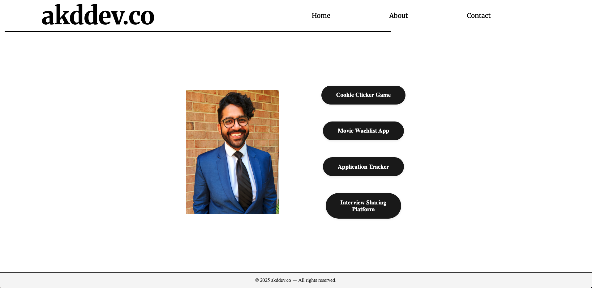

# Abdullah Durrani's Portfolio

[](https://akddev.co)
[](https://github.com/bootupAbdullah/personal_webpage)
[](https://akddev.co)

> A modern, responsive portfolio showcasing web development projects and skills in front-end technologies and interactive applications.

## 🚀 Live Demo
**[Visit Portfolio →](https://akddev.co)**

## 🛠️ Tech Stack
- **Frontend:** React, JavaScript, CSS3, HTML5
- **Styling:** CSS Flexbox, Responsive Design
- **Hosting:** [Your hosting platform]
- **Deployment:** Automated via [platform]

## ✨ Features
- **Single-page layout** - All content visible without scrolling
- **Responsive design** - Optimized for all device sizes
- **Modern UI** - Clean, professional styling with pill-shaped buttons
- **Component-based architecture** - Organized React components
- **Smooth navigation** - Intuitive user experience

## 📁 Project Structure
```
├── src/
│   ├── components/
│   │   ├── Home/
│   │   ├── Nav/
│   │   └── Footer/
│   ├── images/
│   └── styles/
├── public/
└── README.md
```


## 📈 Development Journey

### Latest Updates (June 14th, 2025)
- ✅ Single-page viewport layout implementation
- ✅ Responsive flexbox architecture
- ✅ Footer integration and positioning
- ✅ Modern button styling and spacing
- ✅ Clean CSS optimization

<details>
<summary>📸 View Current Build</summary>


</details>

<details>
<summary>🔧 Technical Implementation Details</summary>

**Layout Architecture:**
```jsx
<main className='main-component'>
  <div id='navbar-component'><Nav /></div>
  <div id='home-component'>{page === "Home" && <Home setPage={setPage} />}</div>
  <Footer />
</main>
```

**Key CSS:**
```css
.main-component {
    min-height: 100vh;
    display: flex;
    flex-direction: column;
    justify-content: space-between;
}
```
</details>

## 📞 Contact
- **Website:** [akddev.co](https://akddev.co)
- **Email:** [your.email@domain.com]
- **LinkedIn:** [Your LinkedIn]

---

# July 1st, 2025:

## 📋 Recent Feature Additions

### New Pages & Functionality
- **About Page** - Provides context and insights into my development journey and background
- **Experience Page** - Brief overview of professional experience with downloadable resume functionality
- **Resume Download** - Integrated download icon for accessing full resume PDF

### Deployment & Domain
- **Hosting Platform:** Netlify with automated deployments
- **Custom Domain:** [akddev.co](https://akddev.co) - Professional domain setup
- **SSL Certificate:** Secure HTTPS connection enabled
- **Continuous Deployment:** Automatic updates from repository pushes

### Enhanced User Experience
- **Multi-page navigation** between Home, About, and Experience sections
- **Professional presentation** with downloadable resources
- **Fast loading** optimized through Netlify's CDN